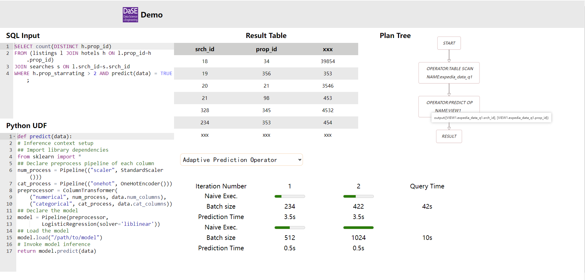
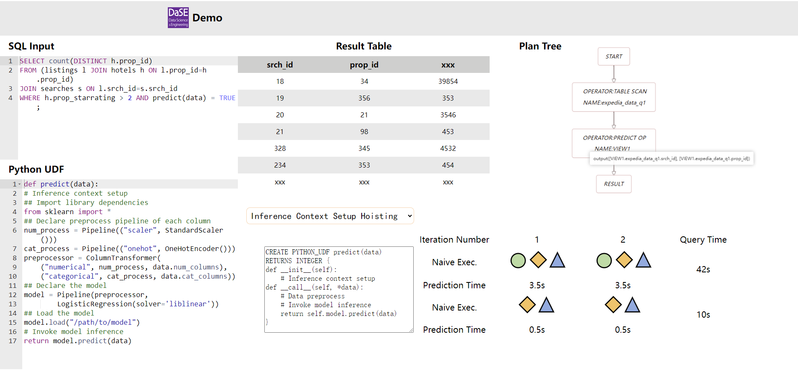

<!-- ### todo

- [ ] analyze 横向排列
- [ ] css/js 隔离


### 效果图






```python
def predict(data):
# Inference context setup
## Import library dependencies
from sklearn import *
## Declare preprocess pipeline of each column
num_process = Pipeline(("scaler", StandardScaler()))
cat_process = Pipeline(("onehot", OneHotEncoder()))
preprocessor = ColumnTransformer(
    ("numerical", num_process, data.num_columns),
    ("categorical", cat_process, data.cat_columns))
## Declare the model
model = Pipeline(preprocessor,
        LogisticRegression(solver='liblinear'))
## Load the model
model.load("/path/to/model")
# Invoke model inference
return model.predict(data)
```


```sql
EXPLAIN FORMAT=JSON SELECT srch_id, prop_id FROM expedia_data_q1 WHERE PREDICT test_efficiency(srch_saturday_night_bool) = 1;
```


> 0 - output([VIEW1.expedia_data_q1.prop_id]), 
>     filter([test_efficiency(VIEW1.expedia_data_q1.srch_saturday_night_bool) = 1]), rowset=256
>     access([VIEW1.expedia_data_q1.srch_saturday_night_bool],[VIEW1.expedia_data_q1.prop_id])
> 1 - output([expedia_data_q1.__pk_increment],[expedia_data_q1.srch_saturday_night_bool],[VIEW1.expedia_data_q1.prop_id]),
>     filter(nil), rowset=256    access([expedia_data_q1.__pk_increment],[expedia_data_q1.srch_saturday_night_bool],[VIEW1.expedia_data_q1.prop_id]), partitions(p0) is_index_back=false, is_global_index=false, range_key([expedia_data_q1.__pk_increment]), range(MIN ; MAX)always true


```json
{
    "ID":0,
    "OPERATOR":"PREDICT OP",
    "NAME":"VIEW1",
    "EST.ROWS": 399,
    "EST.TIME(us)":6884,
    "output":"output([VIEW1.expedia_data_q1.srch_id], [VIEW1.expedia_data_q1.prop_id])",
    "CHILD_1":{
        "ID":1,
        "OPERATOR":"TABLE SCAN”,
        "NAME":"expedia_data_q1",
        "EST.ROWS":79756,
        "EST.TIME(us)":5997,
        "output":"output([expedia_data_q1.__pk_increment], [expedia_data_q1.srch_saturday_night_bool], [expedia_data_q1.srch_id], [expedia_data_q1.prop_id])"
    }
}
```


```javascript
dataset ={
  nodes: [
    {id: 0, label: "PREDICT OP/nVIEW1",shape: "rect"},
    {id: 1, label: "TABLE SCAN/nexpedia_data_q1",shape: "rect"},
   ],
   edges: [
    {source: 1,target: 0,label: ""},
   ]
}
```


<!-- 执行时加入开始节点 Start； 结束节点 Result -->

<!-- 
1. SQL结果图
2. plan before & after执行计划图
3. 运行结果图
4. 优化点展示


https://reactflow.dev/examples/nodes/drag-handle
https://codesandbox.io/examples/package/dagre  (https://codesandbox.io/p/sandbox/react-flow-neng-li-yan-zheng-forked-tehpbh?file=%2Fpackage.json%3A21%2C15)

https://dagrejs.github.io/project/dagre-d3/latest/demo/hover.html --> 

树图

```
plantree
├─static
│  ├─css
│  │  └─tipsy.css
│  └─js
│     ├─tipsy.js
│     ├─d3.v5.min.js
│     ├─dagre-d3.min.js
│     └─jquery-1.9.1.min.js
└─test.html
    